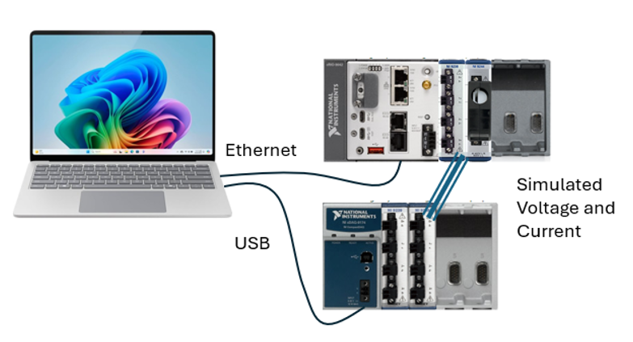
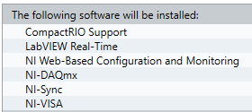
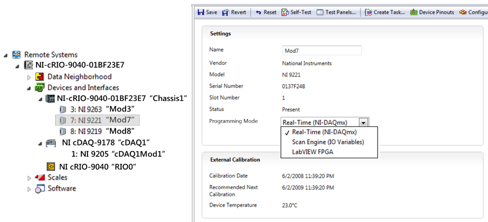
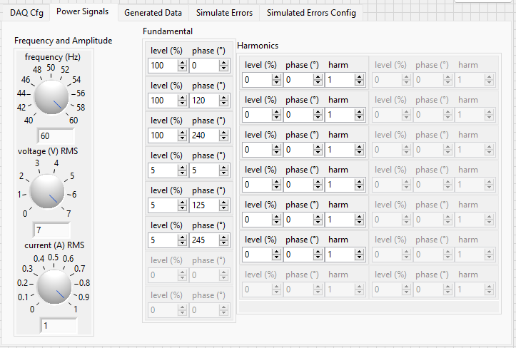
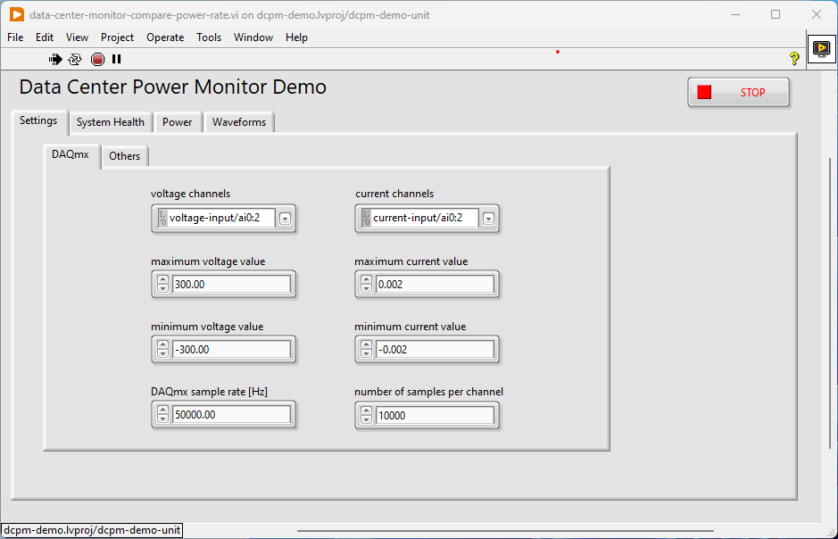
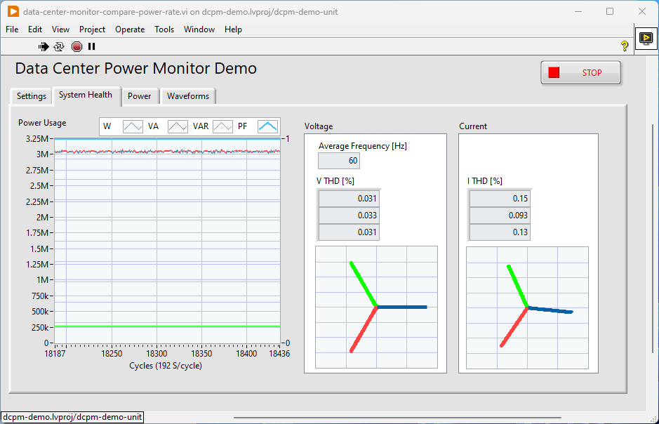
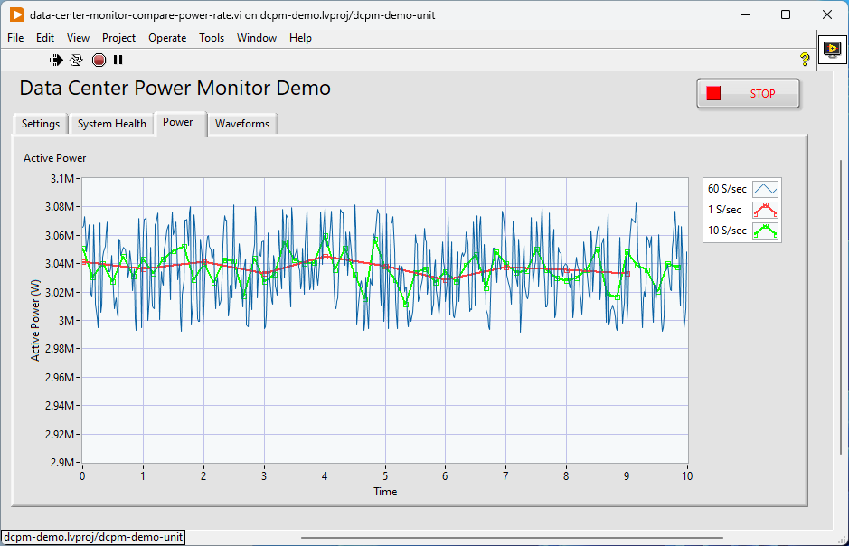
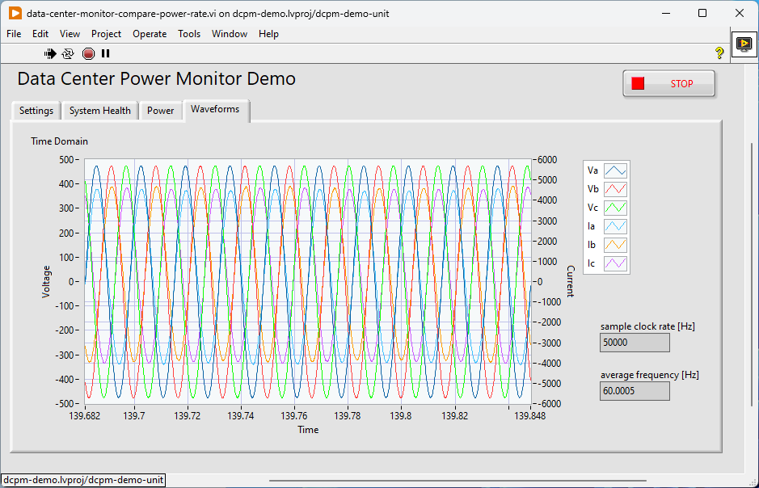

# Datacenter Power Monitor Demo

This demonstration shows how to use NI's cRIO platform and Electrical Power Toolkit to power monitor in a datacenter. A separate CompactDAQ system is used to generate a simulated three phase bus. The simulator does not generate the actual voltage levels in a datacenter such as 480V, but these are scaled in software. This demo uses the NI-9238 module which is designed to work with current transducer with a voltage output of +/-0.5mV or less. Many split-core CTs and Rogowski coils have a +/-0.33V output.

## Hardware Setup

Here's an overview of the hardware setup:  

### cRIO Power Monitor

| Hardware  | Quantity  | Description   |
| --------- | --------- | ------------- |
| cRIO-9049 | 1         | cRIO Controller (other cRIO controllers which support DAQmx will also work)  |
| NI-9244   | 1         | Voltage (PT) Input    |
| NI-9238   | 1         | Split core CT or Rogowski coil input* |

*Rogowski coils require a hardware integrator. This is typically offered with the coil. The integration can also be performed in software, but this demo does not do that.

### cDAQ Three-Phase Power Simulator

| Hardware  | Quantity  | Description   |
| --------- | --------- | ------------- |
| cDAQ-9174 | 1         | cDAQ chassis (any cDAQ chassis with at least 2 slots will work)  |
| NI-9263   | 2         | Voltage output (simulates voltage and current sensors)   |

### Signal Connections

| cDAQ system   | cRIO power monitor    |
| ------------- | -------------------   |
| NI-9263 slot 1 AO 0   | NI-9244 AI 0  |
| NI-9263 slot 1 AO 1   | NI-9244 AI 1  |
| NI-9263 slot 1 AO 2   | NI-9244 AI 2  |
| NI-9263 slot 2 AO 0   | NI-9238 AI 0  |
| NI-9263 slot 2 AO 1   | NI-9238 AI 1  |
| NI-9263 slot 2 AO 2   | NI-9238 AI 2  |
| cDAQ ground           | cRIO ground   |

## Software Setup

Software should work with newer versions of these dependencies. Unless otherwise noted, software can be downloaded with the [NI Package Manager](https://www.ni.com/en/support/downloads/software-products/download.package-manager.html#322516).

Software dependencies:

- LabVIEW 2024 Q3 32-bit
- LabVIEW Real-Time Module 2024 Q3
- LabVIEW Electrical Power Toolkit 2023 Q3
- NI DAQmx 2024 Q4
- NI RIO 2024 Q4

### Installing Software on cRIO

- Install the latest base system OS such as Linux RT System Image 2024 Q4
- Select LabVIEW 2024 as the programming environment
- When adding more software to the install, make sure that NI-DAQmx is selected.  

### Set DAQmx Programming Mode

Make sure to set the programming mode of the cRIO modules (NI-9244 and NI-9238) in NI MAX.  

## Running the Demo

### cDAQ Simulator VI

- Open the LabVIEW project for the simulator. This can be found in the demo\source\data-center-simulator directory of the repo.
- Open the *data-center-simulator* VI.
- Set your physical channels.
  - On the DAQ Cfg tab, select the physicals channel you want to use. The three voltage channel are first and then the three current channels.
- Run the VI.
- On the *Power Signals* tab, you can adjust the power line frequency, nominal voltage and current levels, individual phase levels and phase. Start with the defaults as a good starting point and you can adjust during the demo to show live changes.  

- On the *Simulate Errors* tab, you can inject a harmonics or spikes (amplitude changes) on to the current signals.
- On the *Simulated Errors Config* tab you can configure some settings for the behavior of the simulated errors. It is recommended to leave the default settings.

### cRIO Power Monitor VI

- Open the LabVIEW project for the power monitor. This can be found in the demo\source\ directory of the repo.
- Connect to your cRIO target.  
- Open the *data-center-monitor-compare-power-rate* VI.
- On the *Settings* tab, configure the voltage and current channels to match to module names in your system. You should not need to change any other settings on this tab.  

- Run the VI.
- The *System Health* tab displays an overview of power calculations. You'll see the real, reactive, apparent power and power factor on the chart along with THD and phasor diagrams.  

- The *Power* tab compares calculating real power at different rates. When the simulator is set to inject spikes, you'll notice that the calculations at 60S/sec do a much better job of capturing the actual behavior as compared to the 10S/sec or 1S/sec data.  

- The *Waveforms* tab displays the time domain data from all of the channels.  

